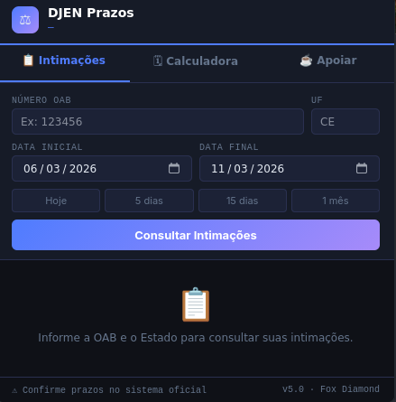
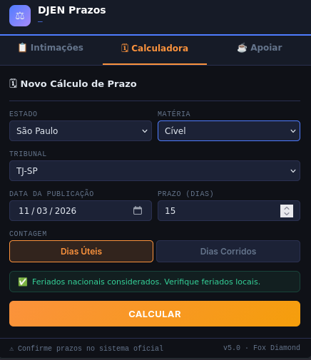

# ⚖️ DJEN Prazos

Extensão do Firefox para **consulta de intimações no Diário da Justiça Eletrônico Nacional (DJEN)** por OAB, com **identificação automática de prazos processuais** e **calculadora de vencimentos considerando feriados nacionais**.

Projeto voltado para **advogados e operadores do Direito** que desejam acompanhar publicações e calcular prazos de forma mais rápida e segura.

---

# 🚀 Recursos principais

- 📋 Consulta de intimações por **OAB e período**
- ⚠️ **Identificação automática de prazos** nas publicações
- 📅 Calculadora de prazos com **dias úteis e corridos**
- ⚖️ Consideração automática de **feriados nacionais e municipais**
- 💾 Exportação das intimações em **.txt**
- ☕ Projeto **independente e gratuito**

---

# 📸 Demonstração

## Tela principal

## Consulta de prazos

---

# 📥 Download

Baixe a versão mais recente da extensão na página de **Releases**:

- 📦 [Download](https://github.com/lZzFOXzZl/DJEN-Prazos/releases/download/v6.0-beta/djen-prazos-v6.zip)

---

# 🔒 Segurança

Esta extensão:

- ❌ Não coleta dados pessoais
- ❌ Não envia informações para servidores externos
- ✔️ Apenas consulta dados públicos do DJEN

---

# 📌 Status do projeto

⚠️ **Versão em testes (Beta)**  

A extensão está aguardando aprovação no repositório oficial do **Firefox Add-ons**.

---

# ☕ Apoiar o projeto

Se o DJEN Prazos te ajudou de alguma forma, considere apoiar o projeto.

Um **QR Code para contribuição** está disponível na aba **Apoio** da extensão.

---

# 📄 Licença

Este projeto está licenciado sob os termos da licença incluída no repositório.

---

# 👨‍💻 Autor

Projeto desenvolvido por **FOX DIAMOND**.
